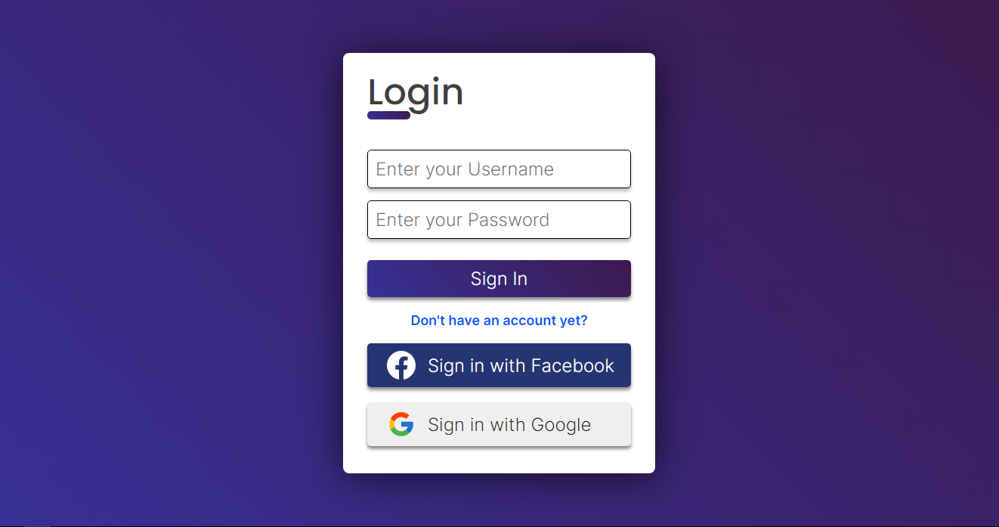

<h1 align="center">Login Page</h1>

# Used technologies

<ul>
  <li>HTML</li>
  <li>CSS</li>
  <li>JavaScript</li>
</ul>

# Figma File

I always want to learn something new, so this time i tried to create a layout on Figma.

[Figma Layout](https://www.figma.com/file/zcHO2TMmqjV7G1lccNRJck/Untitled)

# How to test it

[Click Here](https://login-page-pi.vercel.app)
